# OOPD_Project

A mini social networking site.
1. Notification area
2. Post status message
3. Wall
4. Friend list
5. Login
6. SignUp
7. Log out
8. Email Verification
9. Profile pic upload.

Screenshots:

1. Project Structure
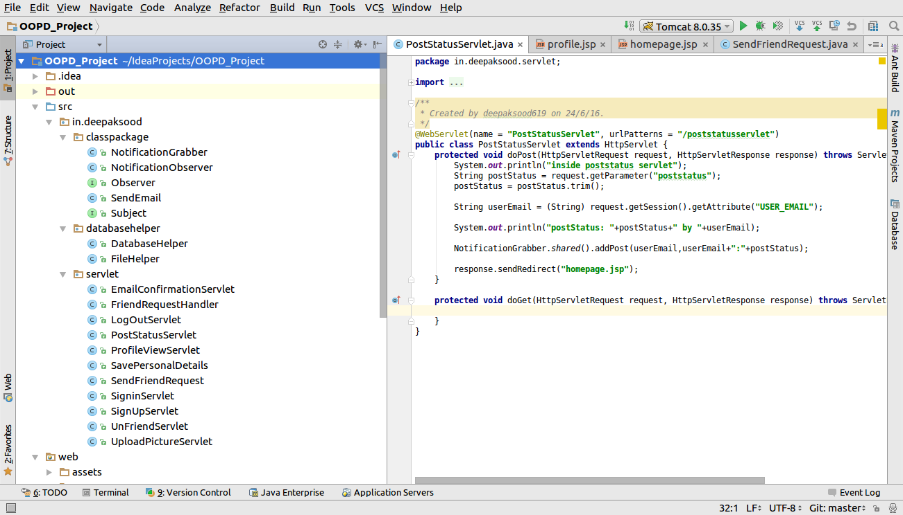
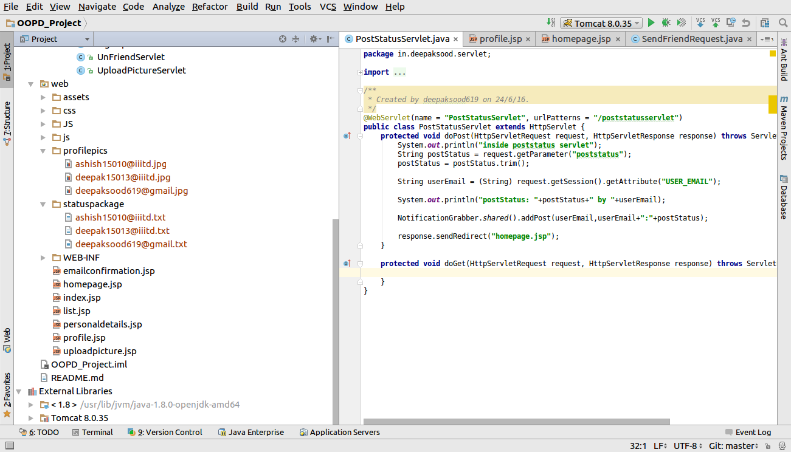

2. Signup Screen
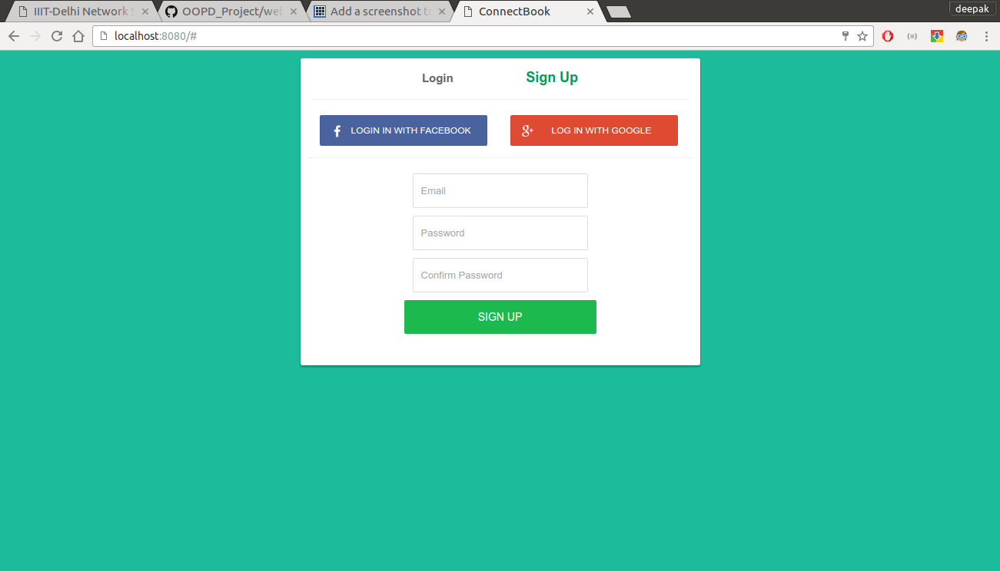

3. Login Screen
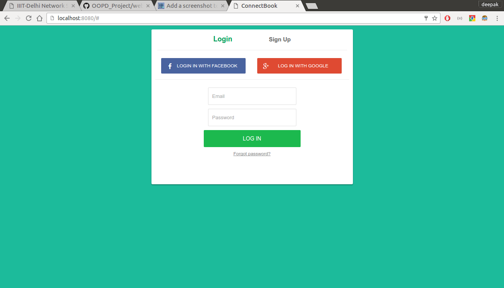

4. OTP Screen Send through mail using JavaMail API and google's SMTP server.
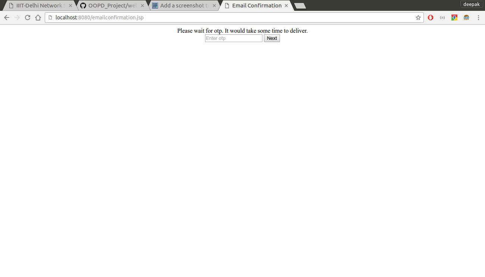

5. User Registration Form for other details
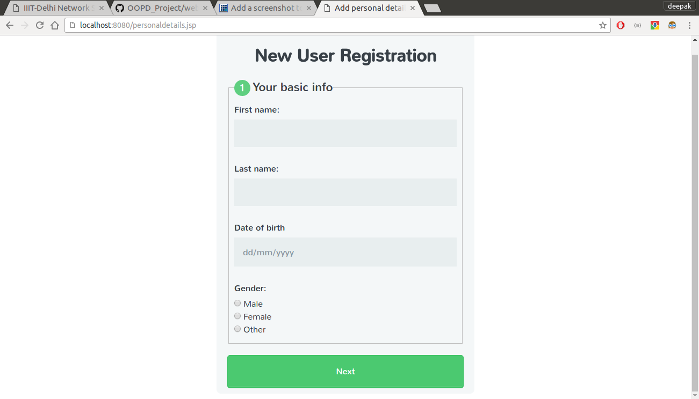

6. Upload picture page
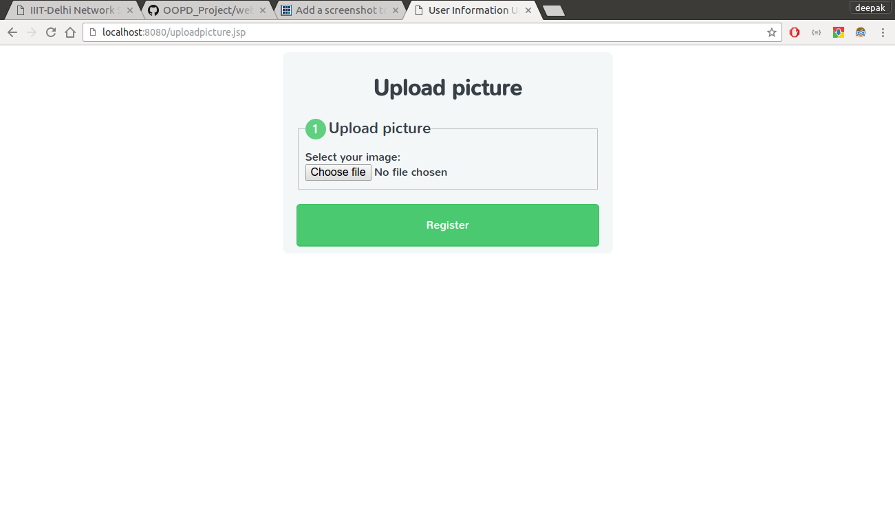

7. User Homepage
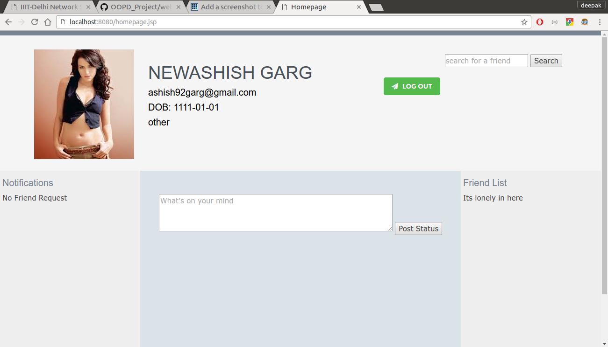

8. FriendList on right side
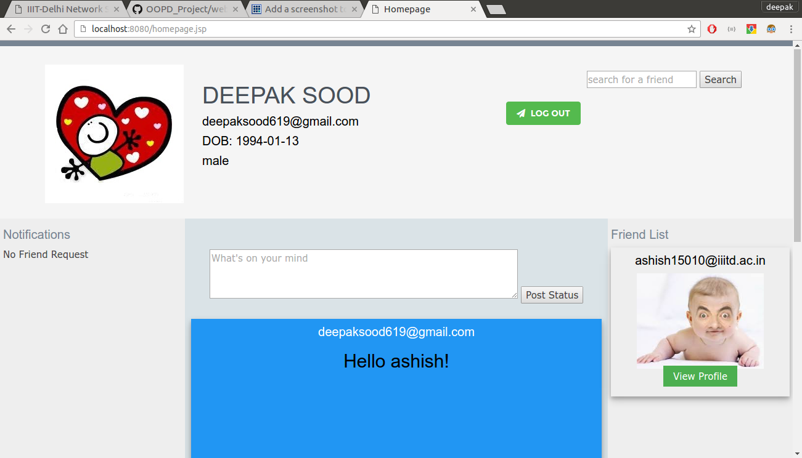

9. Status updates on center
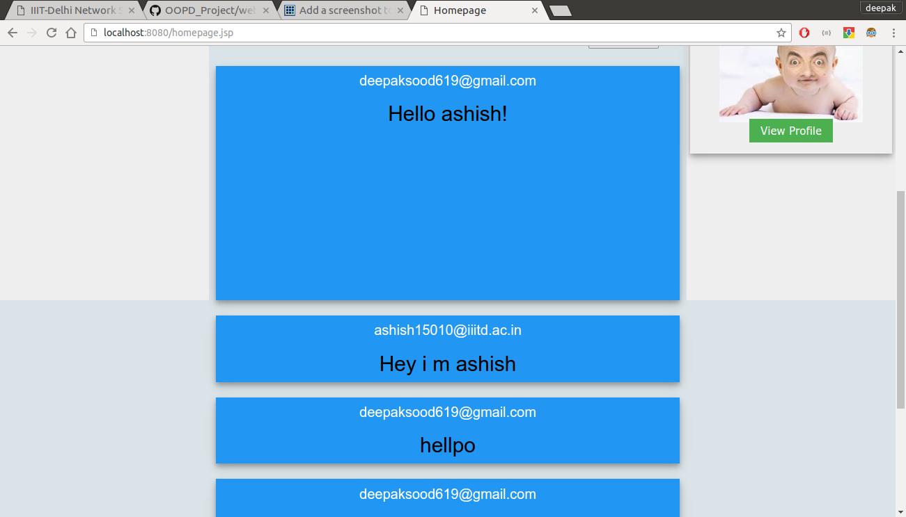

10. Profile view of other users using search box or friends list
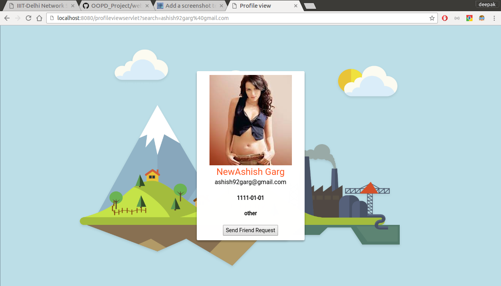

11. Search box with autoComplete feature.
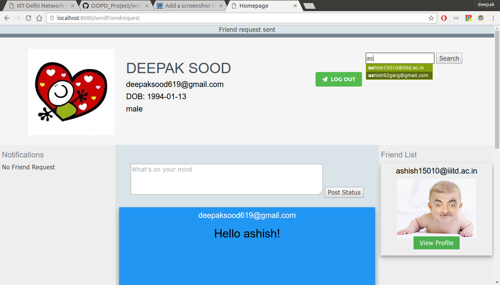

12. Friend request notification
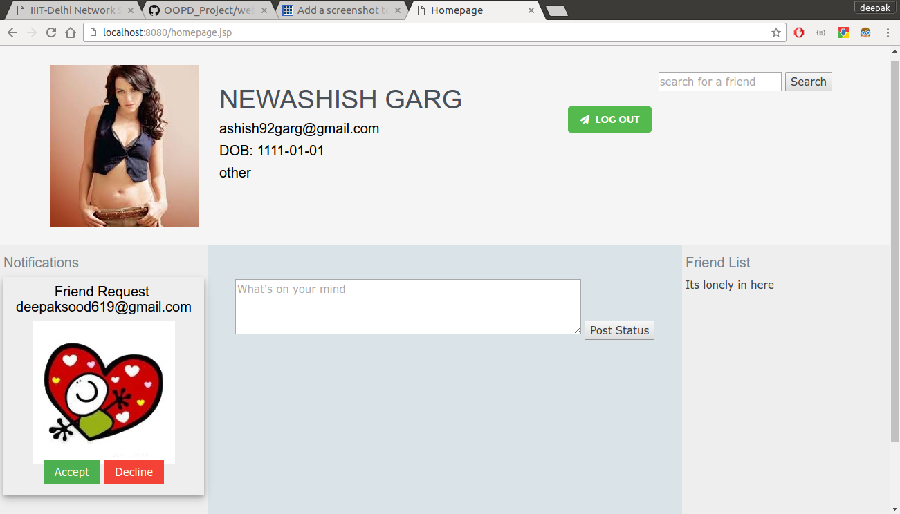
